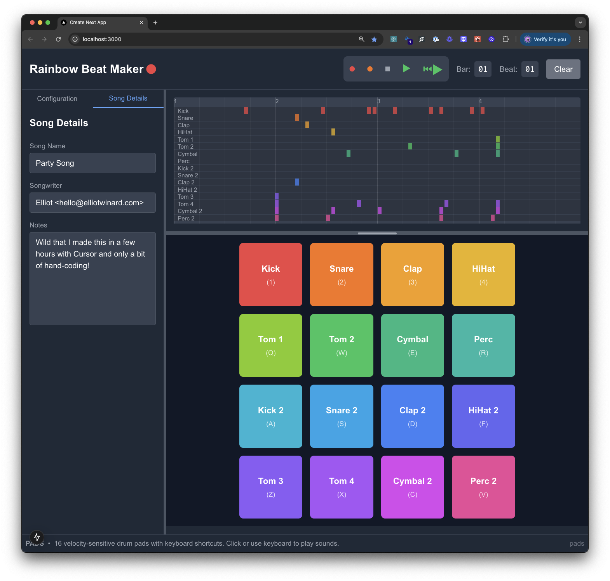

# Rainbow Beat Maker

A web-based drum machine/beat maker built with Next.js and Web Audio API. Features a 4x4 grid of drum pads that can be triggered via mouse clicks or keyboard shortcuts. The rainbow color scheme was inspired by Noelle's design suggestions.




## Features

- 16 drum pads with unique sounds
- Keyboard shortcuts for quick access (displayed on pads)
- Visual feedback when pads are triggered
- Rainbow color scheme for easy pad identification
- Toggle keyboard shortcut display with 'K' key
- BPM control
- Play/Stop functionality
- New layout with timeline
- Recording functionality
- Pattern sequencer

## Keyboard Layout

```
1 2 3 4
Q W E R
A S D F
Z X C V
```

## Getting Started

1. Clone the repository
2. Install dependencies:

```bash
npm install
# or
yarn install
```

3. Add drum samples:
   Create a `public/samples` directory and add the following `.wav` files:

   - kick.wav
   - snare.wav
   - clap.wav
   - hihat.wav
   - tom1.wav
   - tom2.wav
   - cymbal.wav
   - perc.wav
   - kick2.wav
   - snare2.wav
   - clap2.wav
   - hihat2.wav
   - tom3.wav
   - tom4.wav
   - cymbal2.wav
   - perc2.wav

   (Note: Sample population script coming soon!)

4. Run the development server:

```bash
npm run dev
# or
yarn dev
```

5. Open [http://localhost:3000](http://localhost:3000) in your browser

## Technologies Used

- Next.js 14
- React
- TypeScript
- Tailwind CSS
- Web Audio API

## Coming Soon

- Script to populate samples
- Sound customization
- Save/load patterns
- Share beats with others
- Sample libraries
- Save/load
- Arrangement view
